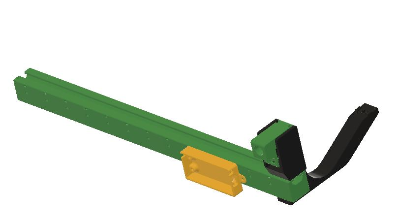
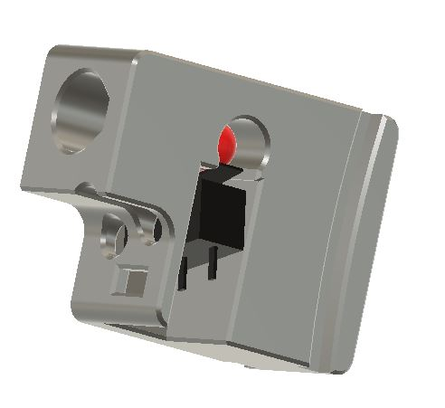

# **Pre-Gates-Sensors**

### **This is an alternative to the pre-gate cottontail version.** 

**It is composed of:**
  * printed rail that is hooked up at the bottom of the ERCF V2 by 2 arms. This can also be a 2020 extrusion. The rail is designed for 13 gates + bypass, But can be cut in the slicer to the needed length. The bypass position can be anywhere.
  * the back side of the rail gives the possibility to hook up a small box that can receive a PI Pico in case the MCU does not have enough inputs for the Pre-Gate switches.
  * The back side of the rail gives also the possibility to attach the wires with tie wraps.
  * on top of the rail, comes the Pre_Gate sensor guides
  * in the guides, the Pre_Gate sensor body can slide freely in.

**The Pre_Gate Sensor body.**

  * This pregate sensor fixes the false triggering issue present in the other Pre-Gate sensor known to date.
  * the ball is at 90° instead at of bellow the filament. Thus the ball can't see the notch ground in the filament by "bad" load.unload. This makes it more reliable.
  * The switch is installed with its lever, and therefore, the trigger point can be adjusted by bending the lever a little bit.

## Summary.
* **[Bom](#bom)**
* **[Printing Tips](#printing-tips)**

 

# BOM
   * 2 M3 inserts
   * N+2 M3 T-Nuts 
   * N+4 M3x8 SHCS
   * N 5.5mm ball bearing
   * N Omron Switches D2F with lever
   * 2xN+2 M2x10 Self tapping screws (2 are for the PI Pico box)
   * N ECAS or magnet holder
   * N 2 pins Dupond male connectors straight or angled 

# **Printing tips**

**What to print**
  * 1 Pre-gate-Extrusion.stl ( Use your slicer to cut the rail to length )
  * 2 Pre-gate_arms_x2.stl
  * N Pre-gate_holder_xN.stl
  * N Pre-gate_main_body_stl
  * 1 Pre-gate-bypass.stl ( optional )
  * 1 Pre-gate_PI-pico_box.stl ( optional )